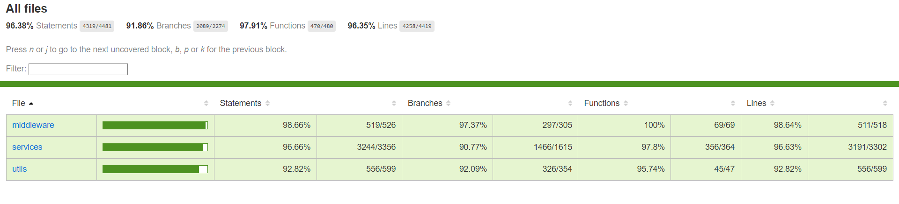

# 
Read-it RESTful API

## 📝 Table of Contents

- [About](#about)
- [Technology](#tech)
- [Get started](#get-started)
- [API Documentation](#apidoc)
- [Functional Documentation](#funcdoc)
- [Useful Scripts](#scripts)
- [Some Features and Demo videos](#feat)
- [Coverage Report](#covreport)
- [Contributors](#Contributors)
- [License](#license)

## About 
- A RESTful API that mimics the backend part of reddit.
- Reddit is a social news aggregation, content rating, and discussion website. Registered users (commonly referred to as "Redditors") submit content to the site such as links, text posts, images, and videos, which are then voted up or down by other members. Posts are organized by subject into user-created boards called "communities" or "subreddits". Submissions with more upvotes appear towards the top of their subreddit and, if they receive enough upvotes, ultimately on the site's front page. Reddit administrators moderate the communities. Moderation is also conducted by community-specific moderators.

## 💻 Built Using 
- **Node.js**
- **Express.js**
- **MongoDB**
- **Mongoose**
- **Jest**
- **jsdoc**
- **swagger to generate api documentation**
- **bcryptjs to encrypt passwords**
- **crypto to generate tokens**
- **multer to upload files**
- **nodemailer to send mails**
- **express rate limit to avoid DOS attacks**
- **Firebase Cloud Messaging for push notifications**

## 🏁 Getting Started 
> This is an list of needed instructions to set up your project locally, to get a local copy up and running follow these
> instructuins.

1. ***Clone the repository***
        `$ git clone https://github.com/Reddit-Replica/SW-Backend.git`
  
2. ***Navigate to project folder and create file named ".env"***
 `$ cd SW-Backend & touch .env`

3. ***Fill ".env" file***
    
<blockquote> 
 
        BCRYPT_PASSWORD = your password to encrypt passwords  
        SALT_ROUNDS = salt rounds needed to encrypt passwords  
        TOKEN_SECRET = your JWT token secret  
        MONGO_URL = your database connection string like:<code> mongodb://localhost:27017/Read-it </code> 
        MONGO_URL_TESTING = your testing database connection string like:<code>mongodb://localhost:27017/Read-it-test </code> 
        FRONT_BASE= the frontend base url like:<code> http://localhost:8081</code> (used in sending emails)  
        MAILGUN_API_KEY = your mailgun api key  
        SENDER_EMAIL = your sender email  
        DOMAIN= your domain  
        REQUEST_LIMIT= number of requests allowed in 15 minutes  
        MONGO_URL_SEED = your database connection string like:<code>mongodb://localhost:27017/Read-it-seed </code>(data will be seeded in that database)  
 </blockquote>
    

4. ***Install dependencies***
`$ npm install`
5. ***Run seeder***
    From that [script](#seederscript)
6. ***start application in development mode***
    `$ npm run dev`
7. ***Login***
        You can login by any username and password:`12345678`

## API Documentation 
- A live version <a href="https://zeyadtarekk.github.io/Read-it-API-Documentation/">here</a>
- You can download the OpenAPI specification for that live link.
- You can generate the OpenAPI specification from that [script](#apiscript) then you will find it in `documentation.json`. 

## Functional Documentation 
- You can generate the functional documentation from that [script](#funcscript) then you will find it in `docs/index.html`

## Useful Scripts 

#### Run in development mode 
`$ npm run dev`

#### Run in deployment mode 
`$ npm start`

#### Run unit tests
`$ npm run test` You will find the test report in `test-report.html`

#### Generate coverage report
`$ npm run coverage` you will find it in `coverage/index.html`

#### Generate OpenAPI specification 
`$ npm run doc` you will find it in `documentation.json`

#### Generate Functional Documentation report 
`$ npm run jsdoc` you will find it in `docs/index.html`

#### Run seeder 
- Change the number of needed users, posts, messages, sunreddits, comments from `seeds/seeder.js` file in line 15, 16, 17, 18, 19
- Then run `$ npm run seed`

#### Run linter
`$ npm run lint`

#### Run prettier
`$ npm run prettier`

## 📷 Some Features and Demo videos 

### *🔒 User Authentication*

- Login using Google
- Login using Facebook
- Signup
- Login
- Forget password
- Forget username
- Change password

https://user-images.githubusercontent.com/88618793/210153405-c8d45f3a-6a4c-4a6a-a5d5-91ff5dc1b05a.mp4

https://user-images.githubusercontent.com/88618793/210153668-db11ae16-188b-43a8-a3f5-17949b38392b.mp4

---

### *🙍‍♂️ User Profile*
- Profile overview (posts, comments, upvotes, downvotes, etc.)
- Your Posts
- Your Comment
- Your Upvotes
- Your Downvotes
- Your Saved Posts and Comments
- Your Hidden Posts and Comments
- Your History
- Your Followers

https://user-images.githubusercontent.com/88618793/210153575-2b2c5f6e-8eba-490d-adb2-fc4a9427a4e8.mp4

https://user-images.githubusercontent.com/88618793/210153668-db11ae16-188b-43a8-a3f5-17949b38392b.mp4

---

### *📰 Post*

- Create rich text post
- Create image and video post
- Create link post
- Add flair to post
- Add spoiler to post
- Add nsfw to post
- Upvote and downvote post
- Save post
- Hide post
- Share post
- Edit own post
- Delete own post
- Lock own post

https://user-images.githubusercontent.com/88618793/210153555-d5283185-20b8-40de-bebf-db947d56d3d6.mp4

https://user-images.githubusercontent.com/88618793/210153805-8f874bc8-8c21-4c57-94bf-7d72acf11bff.mp4

---

### *🔎 Search*
- Search by post
- Search by comment
- Search by community
- Search by people

https://user-images.githubusercontent.com/88618793/210153925-f6c00aaf-66cf-497f-9b37-c0cd01920228.mp4

---

### *🗨️ Comment*
- Create rich text comment
- Nested comments up to any level
- Upvote and downvote comment
- Reply to comment
- Edit own comment
- Delete own comment
- Lock own comment

https://user-images.githubusercontent.com/88618793/210153474-68039103-262f-4482-b93f-74b337430675.mp4

---

### *🔔 Notifications*
- Push notifications
- All notifications

---

### *✉️ Messages*
- Send a private message
- All messages
- Unread messages
- Sent messages
- Post replies
- Usernames mentions
- Delete message
- Spam message
- Reply to message

https://user-images.githubusercontent.com/88618793/210153718-1a4ef8e2-6e1b-4c75-b213-6409129fa2f0.mp4

---
### *🤵 Moderator*
- Queues
  - Spamed (posts only, comments only, posts and comments)
  - Edited  (posts only, comments only, posts and comments)
  - Unmoderated (posts only, comments only, posts and comments)
- User management
  - Banned users
  - Muted user
  - Approved user
  - Moderators
- Flairs and emojis
  - Add new flair
  - Edit flair
  - Delete flair
  - Reorder flairs
- Rules and regulations
  - Add new rule
  - Edit rule
  - Delete rule
  - Reorder rules
- Community settings
  - Edit community name
  - Edit community description
  - Edit community topic
  - Edit community language
  - Edit community type (Public, Private, Restricted)
  - Edit community region
- Posts & Comments settings
  - Enable/disable community Spoiler tag
  - Edit suggested sort for posts
  - Enable/disable image in posts
- Community traffic
  - Day of week
  - Month
  - Page views
  - Members joined
  - Members left

https://user-images.githubusercontent.com/88618793/210153879-2ba60a63-663a-426a-a1da-c29be8e5c280.mp4

---

## Coverage Report 

---

## Contributors 

<table>
  <tr>
    <td align="center">
    <a href="https://github.com/ZeyadTarekk" target="_black">
    
     
    <b>Zeyad Tarek</b></a>
    </td>
    <td align="center">
    <a href="https://github.com/AbdelrahmanHamdyy" target="_black">
    
     
    <b>Abdelrahman Hamdy</b></a>
    </td>
    <td align="center">
    <a href="https://github.com/AbdelrahmanNoaman" target="_black">
    
     
    <b>Abdelrahman Noaman</b></a>
    </td>
    <td align="center">
    <a href="https://github.com/BeshoyMorad" target="_black">
    
     
    <b>Beshoy Morad</b></a>
    </td>
  </tr>
 </table>

---

## License 

> This software is licensed under MIT License, See [License](https://github.com/Reddit-Replica/SW-Backend/blob/master/LICENSE) for more information.